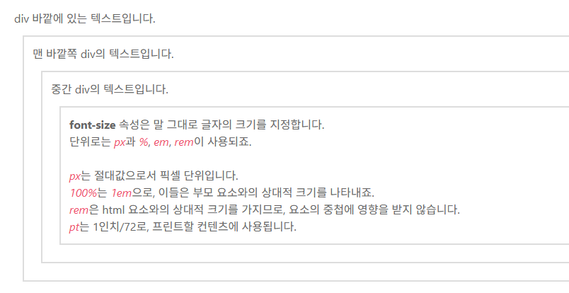
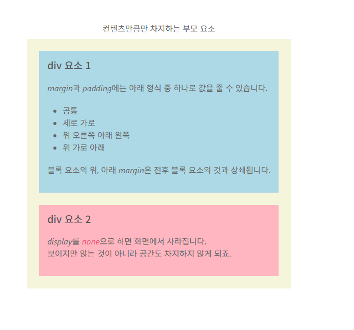

# 글자 스타일

## 기울임 / 굵기

기본문법
```css
선택자 {
  속성1 : 값;
  속성2 : 값;
  ...
}
```

###  font-style
1. italic : 글자를 기울인 서채로 쓴것
2. ablique : 기존 글자에 각도를 넣어서 기울인것
단, 서채마다 보유한게 다름, 하나만 있을수도, 둘다 없을수도 있다.

### font-wieght
굵기, 원래 굵기는 normal, 굵은건 bold, 서채마다 보유여부가 다르고 심지어는 100~900 사이의 숫자 가중치를 두어서 굵기를 미세 조정하는것도 가능하다.

* 참조
HTML 태그를 통해서 서체 지정을 했는데 중복으로 CSS에서 해야만 하는가에 대한 의문이 생길 수 있다. CSS 자체는 스크린 리더가 되지 않는다, SEO에도 관여하지 않는다는 점 때문에 , 실제로 눈에 보이는 화면상의 차이가 없다고 하더라도 HTML / CSS를 둘 다 신경 쓰는 편이 좋다.

## 글자 크기
서체의 경우에는 페이지 상의 일관성을 위해서 고정을 시키지만 하나의 서체라고 하더라도 어느 위계에 있는지에 따라 다양하게 표현될 수 있다.
그런데 웹 상에서의 글자 크지는 유동적으로 변하는 화면에서 사용하기 때문에 지정 방식과 크기를 표현하는 단위가 다양하다.

### font - size
- css에서 가장 많이 작성하는 속성
  - 절대값 : 픽셀px / 포인트pt
  - 상대값 : 퍼센트% / em(부모) / rem(가장 상위,조부모?)
    - 부모 요소의 크기에 비례해서 나타난다.

* 참조 사이트 
https://showcases.yalco.kr/html-css/02-02/02.html



* 참고 - 반응형 웹 :
PC, 태블릿, 스마트폰 등 접속하는 기기의 화면 크기에 맞춰 웹사이트의 레이아웃과 디자인이 자동으로 최적화되어 변하는 웹 페이지 제작 기법

그러면 확인했듯이 em의 경우 부모 자식 구조가 여러 단꼐로 중첩됐을 때 연쇄적으로 영향을 받기 때문에 원하는 만큼 글씨 크기를 조절하는 것이 더 어려울 수 있다.
이때 rem 단위를 사용하는데, 가장 상위 부모, 즉 html 요소를 기준으로 크기를 결정하는데, 중첩된 요소는 모두 동일한 크기가 적용된다.

pt의 경우 웹사이트를 종이로 인쇄할 경우 결과물의 크기를 결정하는 단위에 해당한다.
그래서 연쇄 상황이 아니면 잘 사용하지 않는다.

## 글자 꾸미기
https://showcases.yalco.kr/html-css/02-02/03.html
https://developer.mozilla.org/ko/docs/Web/CSS/Reference/Properties/text-decoration

### text-decoration
- 글자 다양하게 꾸며주는 속성
- 종류
  1. underline : 밑줄
  2. line-through : 취소선
  3. overline : 윗줄
  4. wavy : 물결선
  5. dotted : 점선
  6. dashed : ----- 

### text-transform
- 영문 알파벳 대소문자 표시에 사용됨
- 종류
1. none : 디폴트 값
2. capitalize : 단어의 첫 알파뱃만 대문자
3. uppercase : 전체 대문자
4. lowercase : 전체 소문자

* 참조
- 처음부터 대소문자를 구분해서 쓰면 안되는가의 문제가 있다. 저희가 HTML 문서를 작성할때는 직접 통제해서 쓰기 때문에 이 부분에 대한 체크의 문제가 없지만 만약에 DB에서 받아오게 될 경우 특히 영어의 경우에 어떤 문자형태로 올지 모르기 때문에 보험용으로 작성해두자.

### text-shadow
https://showcases.yalco.kr/html-css/02-02/04.html
- 글자에 그림자를 주는 속성
- 형식 : x좌표 y좌표 (흐림) 색 / 참고 (흐림)은 있을 수도 있고 없을수도 있다.

그림자가 상하좌우 등 여러 곳에 지정될 경우에는 쉼표(,)를 통해서 구분한다.

# 문단과 목록 스타일
- 한정된 공간 상에서의 텍스트를 여러 줄로 나타내는 문단 / 목록 스타일을 CSS로 정의 해볼것이다.

## 정렬과 간격
- 텍스트를 왼쪽, 오른쪽, 가운데로 정렬하거나 자간, 줄 높이, 들여쓰기 등을 지정하는 부분이다.

### text-align
- 상자 스타일의 한정된 공간 안에 텍스트가 여러 줄 들얼갈 때에는 text-align 속성을 이용해서 텍스트 및 인라인 요소의 정렬 방식을 지정
- 속성 값 종류
 1. left
 2. right
 3. center
 4. justify : 양쪽 정렬 - 마지막 줄을 제외하고 각 줄의 끝 부분이 고르게 멀어지도록 자동 조정

### letter-spacing / word - spacing
1. letter-spacing : 글자간
2. word-spacing : 단어간 - 띄어쓰기 공백
  - 문단의 세부 요소 간격을 조절할 때는 픽셀보단 상대값인 em을 쓰는게 낫다.
    - 일관성 문제
  - px / em /rem / 음수값도 가능

### line-height
- 줄 높이조절

### text-indent
https://showcases.yalco.kr/html-css/02-03/02.html

## 목록 스타일(list style)
https://showcases.yalco.kr/html-css/02-03/03.html

# 인라인 / 블록 및 박스 모델 이해
ch06_inline_block

## 기본 너비와 개념
https://showcases.yalco.kr/html-css/02-05/01.html
어제 배웠던 대로라면 `<span>` vs. `<div>`의 성격상의 차이가 있다
그런데 그건 HTML상에서의 태그 성격일 뿐이고, CSS로는 그것도 반전시킬 수 있다.
display 속성을 이용할 수 있다.

display 속성의 속성 값
  1. inline : 컨텐츠 길이의 영역만큼만 차지하게끔 설정
    - 너비를 인위적으로 설정 불가능
    - 높이도 마찬가지
  2. block : 컨텐츠 길이가 차지하는 행 전체 영역만큼 설정
    - 너비, 높이를 인위적으로 설정하는것이 가능하다.
  3. inline-block : 컨텐츠 길이만큼 차지한다(인라인 성격) 또한 인위적으로 너비와 높이를 인위적으로 조절가능하다(블록)

## 너비와 높이 조절하기
- width : 너비
- height : 높이

## 여백 적용하기
- margin : 원랜 자기 영역밖을 나갈 수 없지만, 상하좌우만큼 컨텐츠 바깥영역을 채울 수 있다.
  - 컨텐츠 영역을 채우지 않는다.
- padding : 컨텐츠 안의 여백 - border를 기준으로 안쪽이기 때문에 시각적으로 커져보인다.
근데 내부 컨텐츠 영역이 인위적으로 늘어난것이라 하자가 많다.

# 박스 모델
## 요소의 크기
https://showcases.yalco.kr/html-css/02-06/01.html
요소(컨텐츠)의 크기라고 했으니까 기본적으로 display가 block이거나 inline-block일것이다.
고정값 크기는 보통 px, 브라우저나 모니터 사이즈나 혹은 모바일에 따라서 달라지기 때문에
px는 불편할 수 있다.

이때 상대값으로 퍼센트를 사용하면 부모 크기에 따라 비례한 길이가 된다.
디바이스에 따라 유동적으로 크기를 조절할 때 유용한 기능이 뷰포트이다.
실제 창의 크기라고 생각할 수 있다.
뷰포트를 이용한 단위가
- vw : 뷰포트를 기준으로 한 가로 길이
- vh : 세로길이
- vmax : 상대적으로 길이가 긴쪽
- vmin : 상대적으로 짧은쪽
  - vmax/min의 경우 어떤 디바이스를 쏟는 가에 따라 다른데 일반적인 pc/laptop의 경우 vmax는 가로 길이겠지만 모바일 폰의 경우에는 '세로길이'에 해당한다.

vw/vh의 경우는 텍스트 크기를 설정하는 데에도 쓸 수 있다. 예를 들어 font-size 10vmin으로 지정한다면
어떤 화면에서 길이가 짧은쪽의 10분의 1정도의 크기를 설정한다고 할 수 있다.

이상과 같이 화면 크기에따라 텍스트의 크기를 동적으로 변화 시킬 수 있다.

텍스트를 영역의 중간에 두는법
```css
div {
  background-color: darkorange;
  text-align : center;
  height: 100vh;
  width: 100vw;
  line-height: 100vh;
  /*height와 line-height를 동일한 값을 주게 되면 텍스트가 한줄일 경우 중간에 위치시킬 수 있다.*/
}
```

또 다른 크기를 조절하는 방법은 복잡한 계산을 컴퓨터에게 넘기는 방식이다.
매개변수를 이용해 css에서 특정한 수치를 계산해주는 함수인 calc()를 이용한다.

예를 들어 calc(100% + 100px)이라고 하면 상대값 100%의 수치에 100px 더 큰 값을 나타내도록 한다.
그래서 절대값 뿐만 아니라 상대값, 그리고 vw, vh 등을 매개변수로 사용할 수 있다.

## 바깥쪽 여백과 안쪽 여백(margin vs padding)
https://showcases.yalco.kr/html-css/02-06/02.html

### margin
1. margin 값을 하나로 지정하는 경우 : 상하좌우 모두 적용
2. 두개로 지정하는 경우 : 상하 / 좌우
3. 네개로 지정하는 경우 : 상우하좌 순서대로 적용(시계순사)
4. 세개로 지정하는 경우 : 상 / 좌우 /하

근데 margin-top/padding-top등 하나하나를 속성으로 지정해줄 수도 있다.

* 주의사항
블록 요소의 위/아래 margin은 전후 블록(웬만하면 div 태그) 요소의 것과 상쇄된다는 특징이 있다. 그래서
문제는 웬만하면 전후의 상하 margin이 동일한 값이면 별로 상관이 없는데<br>
혹시나 div-1의 마진 상하가 30px이고
div2-2 마진 상하가 60px이면, 30px는 무시되고 60px로 결정이 나게된다.



이상의 이미지에서 div2의 경우 4em으로 잡혀서 div1보다 더 넓은 상하마진을 가지기 때문에
마진영역이 4em으로 결정되었다.

개발자 도구 상에서 margin=0으로 바꿔주면

- auto
  - 여백 설정에서 중요한 팁은 auto값이다.
  - 너비가 지정된 블록 요소의 가로 방향에서 남은 공간을 자동으로 채우는 방식
  - auto 속성 자체의 너비 정렬은 여전히 많이 쓰이기는 하지만 flex로 대체

```css
body{
  /* display: inline-block; */
  /* text-align: center; */
}

div {
  /*display: inline-block; 왼족으로 붙는다. auto랑 관계있나?*/
  /* inline-block으로 display 설정하게 되는 경우 width/height의 지정은 가능하지만
  margin에서 auto가 먹질 않는다(inline의 성격) 
  margin auto가 안먹히는 것은 inline 부분의 */
  display: inline-block;
  background-color: orangered;
  width: 200px;
  height: 200px;
  margin: 0 auto;
  border-top: 8px solid black;
  border-bottom: 0.5em wavy black;/*wavy는 안된다.*/
  border-right: 0.5vw dashed black;
  border-left: 0.5vh dotted black;

}

/*
  왜 이상과 같이 했을 경우에만 작동 되냐면  인라인 블록 요소가 지금 박스 모습으로 보이기는 하지만
  기본적으로 텍스트의 흐름을 따라가기 때문에 부모 요소에서 text-align 속성을 지정해줘야
  block 요소처럼 margin으로 조정이 되지 않기 때문

  display : block의 경우 너비와 높이를 지정할 수 있지만 기본적으로 전체row를 
  다 잡아먹는 구조이다. 그렇기 때문에 margin을 통해서 통제가 가능하나 부모 요소에서 
  text로 조절할 수 없다.
*/

p {
  text-align: end;
}

```

## 테두리 측정

요소의 바깥쪽 테두리를 그리게 되면 해당 요소를 강조하거나 명확히 할 수 있다.
특히 테두리 바깥쪽은 margin이고 테두리 안쪽이 padding 이라는 점에서 학습할 때도 도움이 된다.

### border 속성
특정 요소의 테두리 모양을 설정하는 CSS. 속성을 지정할 때는 테두리 선의 굵기와 스타일, 색상을 순서대로 지정하면 된다.
형식
```
border : 선굵기 스타일 색상
```