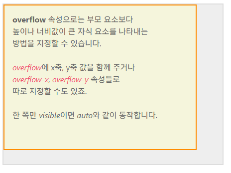

### box-sizing
https://showcases.yalco.kr/html-css/02-07/01.html

box-sizing 속성은 속성값으로
  1. content-box : padding을 제외하고 텍스트/ 이미지 등의 내용이 들어갈 수 있는 영역만 계산함. 예를 들어 div의 width가 440px라면 '내용이 들어갈 수 있는 가로길이'가 440px라는것
  2. border-box :  padding을 포함한 영역으로 좌측 여백+컨텐츠 영역+우측 여백을 합쳐서 div width가 결정됨, box-sizing을 border-box로 설정하고 width가 440px 라면
  24(좌측 여백)+392(컨텐츠 영역)+24(우측영역)으로 440px가 된다. <br>
  추가적으로 border(외곽선)까지 지정했다면, 좌측 외곽선+여백, 컨텐츠 영역, 우측 외곽선+우측여백으로 결정남

위에서 div 요소라고만 이야기하고 있지만, div 태그의 원래 성격이 인위적으로 가로세로길이를 지정할 수 있기 때문이라는 점도 명심

### border-radius
1. 값을 하나만 주는 방법 : 네 군데 모서리에 모두 적용됨.
2. 값을 두 개로 주는 방법 : 상단 왼쪽과 하단 오른쪽 / 상단 오른쪽과 하단 왼쪽
3. 값을 네개로 주는 방법 : 상단 왼쪽부터 시계방향으로 지정됨
https://showcases.yalco.kr/html-css/02-07/01.html에서 확인

```html
<!DOCTYPE html>
<html lang="en">
<head>
  <meta charset="UTF-8">
  <meta name="viewport" content="width=device-width, initial-scale=1.0">
  <title>Document</title>
  <style>
      div{
        /* box-sizing: border-box; */
        border: 5px solid black;
        /* border-color: black;
        border-style: solid; */
        width: 200px;
        height: 200px;
        border-radius: 10em;/*%로는 50*/
        background-color: aliceblue;
        text-align: center;
      }
  </style>
</head>
<body bgcolor="5f5f5f">
  <h1>border-radius</h1>
  <div>
    땃쥐
  </div>
</body>
</html>
```

box-sizing의 디폴트는 content-box다

### overflow
- 부모 요소보다 높이나 너비가 큰 자식 요소를 나타내는 방법을 지정하는 속성
https://showcases.yalco.kr/html-css/02-07/02.html



content-box라면, 자식을 100%차게 만들어도 스크롤 바가 생길 수 있다.
왜 content-box라면 그렇지?

overflow x, y로 hidden을 줘서 스크롤 바를 숨길 수 있다.

- overflow의 기본 속성값은 default로 auto로 잡혀있다.
  - auto : 자식요소가 부모의 요소보다 큰 경우 스크롤바 생성
  - visible : 부모 영역을 벗어난 자식 요소를 그대로 보여주도록 허용
    - visible 속성은 가로세로를 전부 지정해줘야한다. 한쪽만 지정할 경우 auto와 동일한 결과값
  - hidden : 부모 영역을 벗어나는 부분은 아예 보이지 않도록 한다.
  - scroll : auto와 동일하게 영역을 넘어가는 가로세로 지점에 스크롤바를 생성하는데, 차이점으로는 자식 영역이 부모의 영역을 넘어가지 않더라도 일단 스크롤바가 생긴다.
  - 속성값을 두 개 입력할 수 있는데 첫번째가 x/ 두번째가 y
  - overflow x : 가로, overflow y : 세로

## 박스 그림자
https://showcases.yalco.kr/html-css/02-07/03.html

형식 : 
div {
  box-shadow :insert (안에 들어갔는지 여부) | offset-x offset-y (축 두께)
  blur-radius(퍼짐효과 크기) | spread-radius(그림자 크기) | color
}

- 실수값 2개 일때 : x축 두께 / y축 두께
- 3개 : x / y / 퍼짐효과 크기
- 4개 : x / y / 퍼짐효과 크기 / 그림자 크기

spread-radius는 그림자 크기를 지정하기 때문에 양수값을 입력하게 되면 상자보다 더 큰
크기의 그림자가 생성된다. 반면에 음수값을 입력하게 될 경우 그림자 크기가 상자보다 더 작아진다.

insert 효과 : 박스 안쪽에 그림자가 생긴다.

너무 복잡하면 box-shadow-generate 검색

```html
<!DOCTYPE html>
<html lang="en">
<head>
  <meta charset="UTF-8">
  <meta name="viewport" content="width=device-width, initial-scale=1.0">
  <title>Document</title>
  <style>
    div{
      margin: 24px auto;
      width: 240px;
      height: 160px;
      border-radius: 24px;
      box-shadow: 0 0 black;
    }
  </style>
</head>
<body bgcolor="5f5f5f">
  <div></div>
</body>
</html>
```

개발자 도구에서 style파트에 box-shadow부분을 확인하면 아이콘이 있는데 이걸 눌러
개발자 도구에서 그림자를 조종가능

ch07_color_image

# 색 / 페이지로 웹페이지 꾸미기
# 색 표현하기
## 색을 표현하는 방법
### 키워드
- 특정 색상의 이름을 키워드로 입력하는 방법으로 red / green / yellow등
- 대표 색상의 키워드는 css color mdn을 검색

### rgb / rgb(a)
- 빛의 3원색에 해당하는 red/ green / blue를 조합해 색상을 나타내는 방법으로 각 색의 수치를 숫자나 퍼센트를 사용하여 표시한다.
0~255까지 있으며 255가 100%이다.
- rgb(a)의 a는 알파값으로 불투명도를 나타낸다.


### HEX
16진수로 색상을 표기하는 방식으로 5f5f5f를 썼다.
Java에서 객체의 주소값을 할 때 본적이 있다.
0123456789abcdef - 16진수 f는 15<br>
#ffffff - 흰색이다. = rgb(255,255,255)

### HSL(A)
색상, 채도, 명도값 알파값을 조합하여 색을 나타낸다.
채도 : 색이 얼마나 분명하게 나타나는지
명도 : 색의 밝은 정도

그러나 HSL(A)는 색상의 라인이 모든 색을 거친뒤 다시 빨간색으로 돌아가서 마치 360도 회전한것 처럼 보인다.(빨주노초파남보빨)

# 배경 꾸미기
## 이미지를 배경에 사용하기
https://showcases.yalco.kr/html-css/02-08/01.html
배경은 넣고자 하는 이미지 파일을 그대로 삽입하거나 해당 이미지에 css로 다양한 효과를 적용하는것이 가능하다.

### background-image
- 배경에 특정 이미지를 삽입하고 싶다면 background-image 속성을 이용할 수 있는데, 해당 이미지가 있는 절대/상대 주소값을 url값으로 지정한다.
url 형태로 작성하기 때문에 함수/method처럼 보이기도 한다.

### background-repeat
- 배경 크기가 삽입한 이미지보다 큰 경우 삽입한 이미지를 사로세로로 반복해서 나타나게 한다.
repeat가 디폴트다.
- 속성값 목록
  1. repeat : 알아서 반복
  2. no - repeat : 하지마, 한번만 반복
  3. repeat x : x축으로만 반복
  4. repeat y : y축으로만
  5. space : 잘 안쓰임, 이미지를 각 모서리에 먼저 배치한뒤 다음에 남는 공간을 알아서 계산해서 일정한 간격을 두고 배치
  6. round : 배경의 최대 너비와 높이에 맞춰서 그냥 적절하게 계산해서 맞춰준다.
  repeat는 기본 이미지 크기를 그대로 반영하지만, round는 이미지 사이즈를 바꾼다.
  
응용도 가능하다<br>
background-repeat:repeat space; 같은 식으로 x축/y축 두 개의 값을 줄수도 있다.
이상의 코드는 x축은 repeat, y축은 space가 적용이 되었다.

### background-position
  1. %값 : 이미지의 중심축이 되는 배경의 어느 시점에 위치해야할지를 결정할 수 있음.
  50% / 50%로 정했을 때 가로축 / 세로축이기 때문에 center랑 동일한 효과
  2. vw / vh /vmax / vmin 사용가능
  3. 특정 위치를 조합하여 사용하는것도 가능

### background-size
  1. contain : 이미지의 비례와 상관없이 자연스럽게 배경에 맞춰서 이미지를 나타냄
    - 여백이 있을 수 있음
  2. cover : 여백없이 꽉채우는 형태(div에 따라서 이미지가 잘릴 수 있다.)

## 배경에 그라데이션 넣기
css gradient<br>
그라데이션이란 두 가지 이상의 색을 사용하여 두 색을 점점 변화시켜 가며 채색하는 방법으로, 디자인에 특별히 신경 쓰는 포트폴리오가 아닌 이상 자주 쓰이는 방식은 아니기 때문에 색 표현 방식 중에 이런 것도 있다 정도로 알면된다.

### linear-gradient 속성값
그라데이션 적용 원리는 background 속성에 linear-gradient()속성 값을 지정하고, 괄호 내에 argument로 색상을 집어넣는다. 그런데 색상을 표현하는 방식이 네가지 였는데 네가지 다 가능하다.

### linear-gradient로 세가지 색 지정하기


# ch09? position & layout
# 포지셔닝
HTML 문서는 하나의 디바이스로만 여는 것이 아니기 때문에 위치값이 상대적이다.
그래서 상대적인 위치를 잡느 포지셔닝 개념이 중요하다.

## position 속성
https://showcases.yalco.kr/html-css/02-09/01.html

- 특정 HTML 요소들이 해당 페이지에서 어떻게 배지될지를 결정하는데 사용하는 속성
- 부모 요소의 것이 자식 요소에 상속되지 않는다. 즉, 별개로 작동한다

## psition의 속성값들
### static
- 원래 존재하던 페이지 요소의 흐름을 따라감
  - 원해 html 태그들의 위치를 따라간다.
- top/bottom/left/right/z-index의 위치 속성의 영향을 안 받는다.

### relative
- 원래 있던 위치를 기준으로 top/bottom/left/right/z-index의 위치 속성의 영향을 받도록 하는 속성값
- 요소가 차지하는 공백의 위치는 유지된다.

### absolute
- 바로 위 _position 속성의 속성값이 static이 아닌_ (원래 자신의 html 위치가 아닌것) 바로 위 부모 요소를 기준으로 top/bottom/left/right/z-index의 위치 속성의 영향을 받도록 하는 속성값
  - 참고로 직계부모만 그러하며 조부모는 아무래도 상관없다.
- absolute는 자리를 차지하지 않는다. 그래서 그냥 position: absolute를 지정하면 회색 div가 8개에서 7개로 줄어든것 처럼 보인다. **겹쳐있기 때문이다**<br>
사실 회색위에 gold(또는 yellow) div가 있다는것을 알 수 있다.

### fixed
- 부모 요소가 아니라 viewpoint 기준으로 위치를 정하며, 뷰포트이기때문에 스크롤 영향을 받지 않는다.
- 고정된 위치에서 움직이지 않는다는 특지때문에 웹사이트에서 팝업 광고나 nav바에서 주로 쓴다.(nav는 navigate를 줄인것)

### sticky
- 어떤 요소가 스크롤로 이동할 수 있는 공간을 top/bottom/left/right/z-index의 위치 속성값을 이용하여 지정
- 웹사이트 상단에 어느 지점을 고정되는 애가 있다.
- 근데 얘는 또 부모 요소의 여백에 영향을 받는다.
  - 자식이 부모 영역 위치를 벗어나는 식으로 사용하면 그 이상 움직일 수 없다.

### z-index
https://showcases.yalco.kr/html-css/02-09/02.html

# flex 레이아웃 (중요)
- 모든 웹사이트는 큰 레이아웃 형태의 구조로 되어있고, 만드는 방식도 다양하다.
예전에는 inline/block/inline-block을 통해서 하나하나 위치를 지정해주는 작업을 많이 했었는데, flex 레이아웃 적용 이후에는 CSS코드 작성 메커니즘이 좀 바뀌었다.

https://showcases.yalco.kr/html-css/02-11/01.html

## 부모에 적용하는 flex
- flex 레이아웃의 경우 부모 요소에 적용하는 속성과 요소에 적용하는 속성으로 구분된다.
- 이상의 사이트를 기준으로 설명
  - display : block; 의 경우 디폴트값
  - display : flex; 의 경우 보라색 div들이 수평배치됨을 확인가능
  - display : inline flex; 회색 div 부분이 inline-block으로 바뀌면서 자식 요소들은 flex와 동일한 방식으로 배치한다.
  - display 값의 조정은 해당 부모 요소를 inline으로 만드는 것이 flex/inline-flex의 차이점이 된다.

  - 그래서 이하에서 설명하는 내용들은 display : flex / inline-flex를 기준으로 설명하게 된다.

  ### flex-direction
  - 내부 자식 요소들을 어느 축을 기준으로 정렬할지 결정함. 디폴트값은 row
    - row가 기준이라는건, 위에서 아래로 간다는것, 막대가 줄을 선 형태
  - 그래서 display: flex/flex-direction: row일 경우 자식 요소들을 row 방향으로 배치한다.
  - reverse할 경우 오른쪽에서부터 1,2,3...이 된다.즉 왼쪽에서 보면 3,2,1이 되는것
  - flex end는 내 마지막 요소가 끝에 붙게 만드는것, 즉, 왼쪽 끝에 시작이 붙은게 아니라 오른쪽 끝에 마지막이 붙게 만들어 여백의 위치를 바꾸는 효과가 있다.

  - column도 동일한 방식으로 동작한다.
    - 가로로 긴줄이 스택처럼 쌓인 형태
  - display: flex; 를 적용하는 순간 순차적으로 다음 속성의 속성값들을 고려할 필요가 있다.

### justify-content
- 메인 측에서 내부 요소를 정렬하는 방식을 결정
- display : flex를 적용했기 때문에 -> flex-direction: row로 정했으면 -> justify-content:flex-start로 잡았다고 가정했을 때, 그러면 자식 요소들이 row로 정렬되는데, 시작점부터니까 왼쪽부터 정렬될 것이다.
- space-between : 내부 양쪽 요소의 처음과 시작 부분에 배치하고, 가운데에 빈 공간을 알아서 채워 넣는다.
- space-around : 내부 요소의 양옆에 똑같은 빈공간을 준뒤 배치한다.
- space-evenly : 모든 빈 공간의 크기를 일치시킨다.

### align-items
- flex의 마이너 측(flex-direction이 row면 column을 의미)에서 내부 요소를 정렬한 방식을 결정하는 속성

- 디폴트 값으로 stretch가 적용되어 있다. 즉 flex-direction이 row이고, align-items가
strectch라면 마이너가 column이니까 column방향으로 stretch 된다는 것으로 해석가능하다

- 그러면 flex의 디폴트 형태가 왜 123div들이 세로로 길어졌는지 알 수 있다.

- align-items : flex-start로 지정하면 수직 축의 시작부분, 즉, y축 상단으로 내부 요소를 갖다 붙이게 된다.
- align-items : center 중앙 정렬
- align-items : flex-end 하면 y축 하단부터 시작한다.
- 그런데 stretch 제외 나머지가 48px*48px의 이유는 참조 사이트의 설정때문이다.

### flex-wrap
- 자식 요소가 부모의 요소의 영역을 넘어갈 정도로 많을 경우에 하는 배치 방법
- flex-wrap: wrap으로 하면 내부 요소가 부모 요소를 넘어가지 않도록 자동으로 배치해준다.
주로 컨텐츠가 한 줄이 아니라 여러 줄일 때 적용한다.

### align-content
- display:flex / flex-direction: row/ justify-content: flex-start/ align-items : flex-start/
flex-wrap : wrap 이라면 내부 요소에 공백이 다양한 방식으로 생겼다. 예를 들면 이상의 속성값인 경우에 오른쪽 부분에 공백이 생길것이다.
- 이상의 속성값을 유지한 상태에서 align-content를 flex-start / center / flex-end로 바꿨을 경우에는 내부 요소 전체가 공백 _없이_ 위, 가운데, 아래쪽으로 붙는다는것을 알 수 있다.
- 그러면 얘가 align-items랑 관련있겠네 싶겠지만 또 햇갈리게 justify-content처럼 space-between/around/evenly 처럼 간격 조절을 할 수 있는 방법이 따로 있다.

실제 실무까지 갔을때 align-content까지 적용하는 사례가 그렇게 많지는 않다.

### gap
- 내부 요소들 사이에 들어가는 공백의 크기를 지정하는 속성, em 단위 사용 / 두 개의 값을 지정해서 가로공백/ 세로 공백을 별개로 지정가능

## 자식에 작용하는 flex
https://showcases.yalco.kr/html-css/02-11/02.html

### flex-basis / flex-shrink
1. flex-basis : 메인 축의 길이를 지정함. - 중요한 것은 부모 요소가 display : flex가 정해져있는 상태라면 자식 요소들의 너비 / 높이가 고정되는 경향이 있는데, 특정한 지식 요소의 너비 / 높이를 임의적으로 정할 수 있다. // 디폴트값은 auto
2. flex-shrink : 전체 공간이 부족할 경우(즉, 부모 요소의 크기가 고정되어있는 경우) 해당 내부 요소의 크기가 컨텐츠의 너비 또는 flex-basis로 지정한 값보다 알아서 작게 고정될 수 있도록 조절하는 속성.
디폴트 값은 1 // 0으로 입력하면 부모 요소의 영역 바깥으로 빠진다.
  - display : flex를 쓰려면 position을 빡빡하게 설정하지 않는게 좋다.
  오류가 나기 좋기 때문에
  - flex-shrink가 1인 상태에서 자식 요소들이 부모 요소의 크기보다 커지려고 하면 마이너 축 방향으로 늘어난다.

### flex-grow
- 내부 요소에 빈 공간이 있을 경웨 그 공간을 채울지의 여부를 결정하고, 채울 경우에는 자식 요소들끼리의 flex-grow의 값에 따라 비례적으로 부모 영역을 분할하게 된다.

### order 속성
https://showcases.yalco.kr/html-css/02-10/02.html<br>
들어서 건드려 보면 html 태그 순서와 ux의 순서를 다르게 조작할 수 있는 CSS이다.

# 요소를 감추는 방법
## 3가지 방법
### #1 opacity 적용 방법
- 요소의 불투명도를 조절하는 속성으로 0~1 까지의 값을 가진다.
- 안보이는거지 사라진건 아니다.

### #2 visibility
- 속성값
  1. visible
    - 디폴트
  2. hidden
    - 안보이고 기능도 사라진다.
    - 그런데 공백은 존재한다.

### #3 display: none 활용
- 위 효과들과 더불어 공백도 사라진다.
